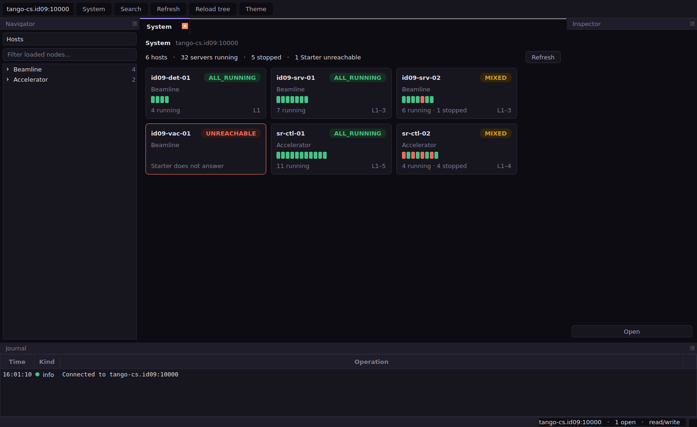
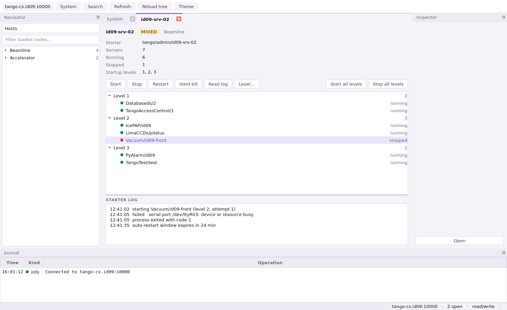
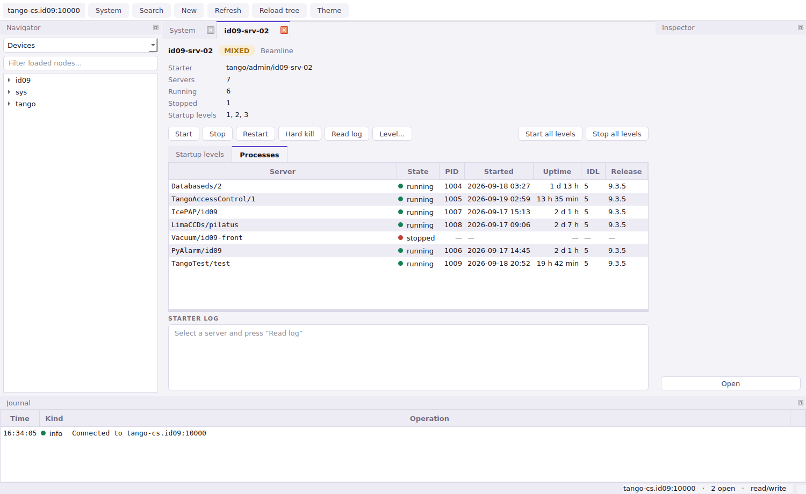
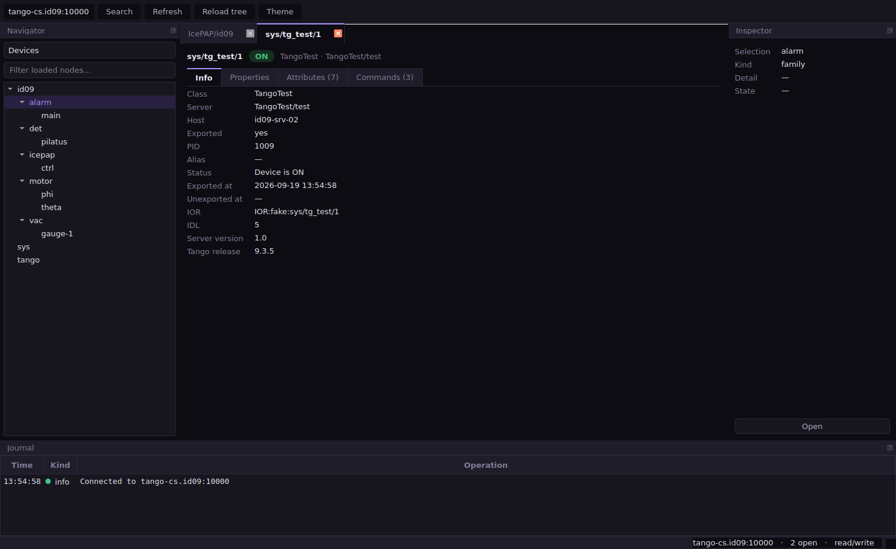
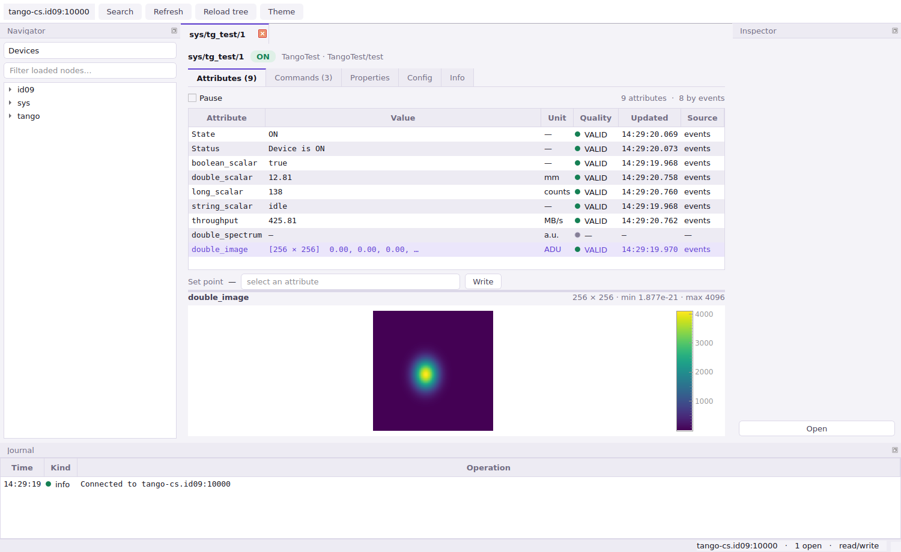
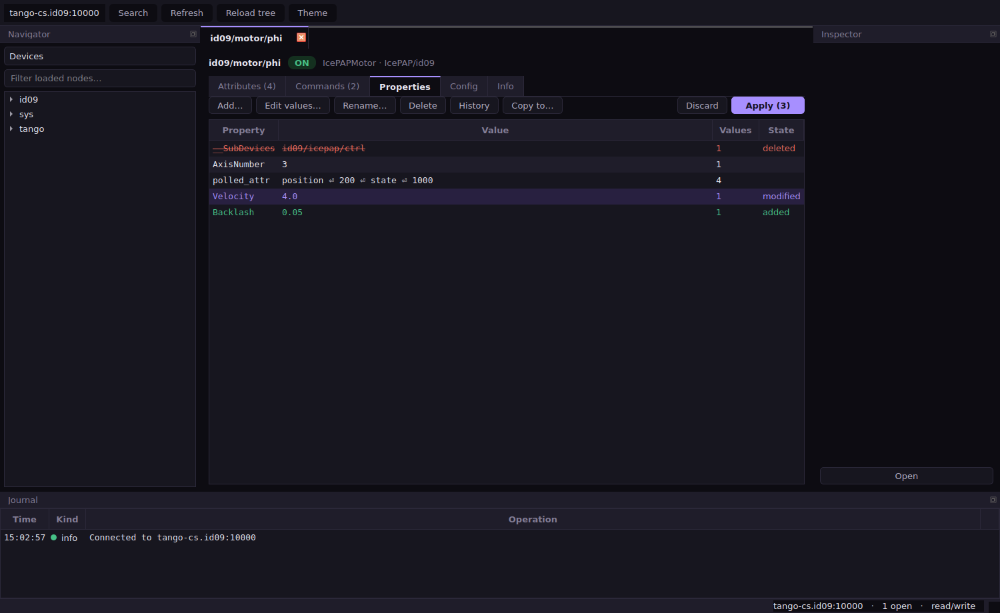
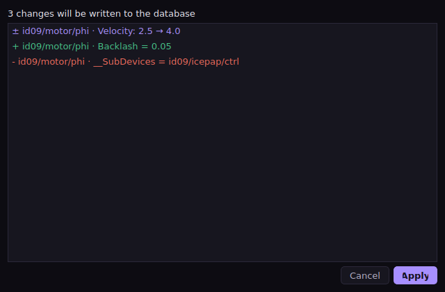

# Milonga

A Qt administration console for [Tango Controls](https://www.tango-controls.org/),
replacing the Java tools *Astor* (process control through Starter devices) and
*Jive* (database editing), with a generic device panel in place of AtkPanel.

*Milonga* is a working name.

## Documentation

| Document | Content |
|---|---|
| [docs/01-functional-analysis.md](docs/01-functional-analysis.md) | What Astor, Jive and ATK do, feature by feature, and the Tango API each feature sits on |
| [docs/02-design-concept.md](docs/02-design-concept.md) | Architecture, key design decisions, package layout, milestones, risks |
| [docs/mockup.html](docs/mockup.html) | Interactive GUI mockup (open in a browser) |

## Status

Milestones 0 to 6 of the plan in the design concept are implemented: the domain
layer, the application shell, the read path of Jive, the live device panel, the
write path, Astor's process control, and the long tail — creation wizards,
polling configuration, and per-process statistics and Tango versions. The
PyTango backend is not written yet, so the application currently runs against
the in-memory demo system.















```
milonga/core/                               no Qt, no PyTango
  names.py, enums.py, errors.py, model.py   value objects and snapshots
  backend/protocol.py                       the async contract, coroutines only
  backend/fake.py, backend/demo.py          in-memory control system, Starter included
  backend/readonly.py                       read-only enforcement in one wrapper
  commands/                                 mutations with preview, apply and revert
  services/diagnostics.py                   PID, uptime and version per server
  store.py                                  snapshots plus diffs
  monitor.py                                subscription ownership, polling fallback
  services/                                 Starter control, inventory, host groups
milonga/ui/                                 the only package importing Qt
  app.py, cli.py                            qasync bootstrap and command line
  theme.py                                  design tokens, light and dark
  tasks.py                                  coroutines tied to a widget's lifetime
  navigator.py                              one tree, six scopes, lazily loaded
  live.py                                   watches held only while a view is shown
  live_hosts.py                             one subscription per host, whole server table
  write.py                                  preview, confirm, apply, journal
  property_editor.py                        editable properties with pending state
  dialogs.py                                diff, confirmation, values, history
  wizards.py                                new server, add device, add host, polling
  format.py                                 Tango values to text and back
  plots.py                                  spectrum and image views
  models/                                   lazy tree, generic table, live values
  panels/                                   overview, host, device, server, class
  mainwindow.py, search.py                  window chrome and the command palette
```

## Running

```bash
.venv/bin/python -m milonga.cli                       # demo control system
.venv/bin/python -m milonga.cli --theme light --scope hosts
.venv/bin/python -m milonga.cli sys/tg_test/1         # open a device at startup
```

Keys: `Ctrl+1` system overview, `Ctrl+K` search, `Ctrl+N` create, `F5` refresh.

The device panel is live: scalar values arrive by Tango events while the panel
is on screen and stop when it is hidden. A spectrum or image is watched only
while it is the selected attribute. Writing an attribute and running a command
are explicit actions, disabled entirely with `--read-only`.

Database edits are held in the table until **Apply**, which previews every
change as a diff, asks again for anything destructive, and records what it
wrote in the journal with an undo.

The system overview and the host panel follow the control system live: one
subscription to each Starter's `Servers` attribute carries the whole server
table for that host. Starting a server is one click; stopping, restarting and
killing ask first, and a hard kill wants the host name typed back.

Servers, devices and controlled hosts are created from the navigator's context
menu or `Ctrl+N`, and removed the same way — every one of those is a command
with a preview and an undo.

## Development

```bash
python3 -m venv .venv
.venv/bin/pip install -e '.[dev,gui]'

.venv/bin/pytest          # 277 tests, no control system needed
.venv/bin/mypy milonga tests
.venv/bin/ruff check .
```

## Demo system

`milonga.core.backend.demo.build_demo_backend()` returns a populated control
system — six hosts in two groups, one of them unreachable, servers across three
startup levels, a `TangoTest` device with scalar, spectrum and image attributes,
and Starter devices that really start and stop servers.

```python
import asyncio
from milonga.core.backend.demo import build_demo_backend
from milonga.core.services.control import StarterControl

async def main() -> None:
    control = StarterControl(build_demo_backend())
    snapshot = await control.host_snapshot("id09-srv-02")
    print(snapshot.state, snapshot.running_count, "running")

asyncio.run(main())
```
